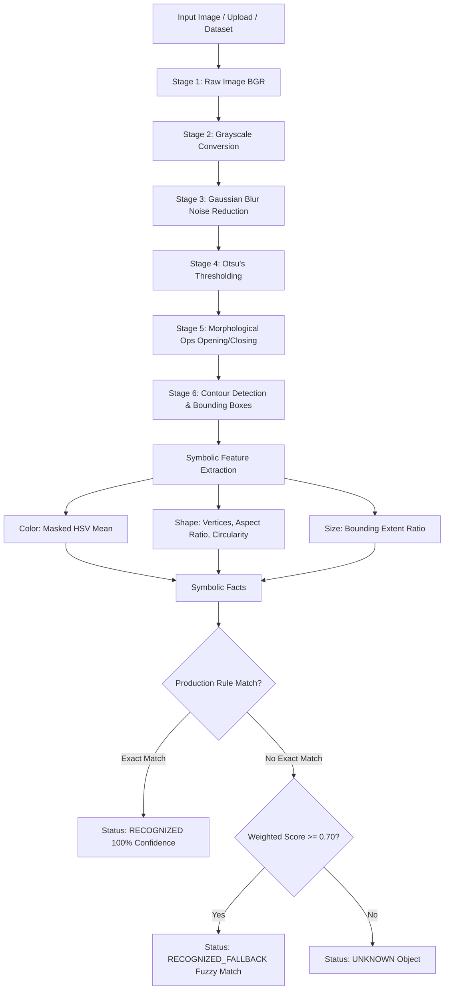

# Classical AI: Knowledge-Based Object Appearance Recognition Hub

[](https://www.python.org/)
[](https://flask.palletsprojects.com/)
[](https://opencv.org/)
[](#license)

A classical Artificial Intelligence (AI) and symbolic reasoning application for object appearance recognition. Built without heavy deep-learning dependencies, this project combines deterministic Computer Vision (CV) feature extraction with a Production Rule Inference Engine to recognize, classify, and acquire knowledge about visual objects.

---

## 🌟 Key Features

- **6-Stage Classical CV Pipeline**: Full transparency into visual image processing—from raw input to contour segmentation and feature extraction.
- **Symbolic Fact Extraction**: Automatic extraction of symbolic attributes (Color, Shape, Size) from image contours using HSV color analysis and geometry polygon approximation.
- **Production Rule Inference Engine**: Dual-mode reasoning using exact Production Rule matching combined with a weighted fuzzy similarity fallback ($W_{\text{color}}=0.45, W_{\text{shape}}=0.35, W_{\text{size}}=0.20$).
- **Interactive Knowledge Base Management**: Real-time rule addition, deletion, and persistent JSON storage (`knowledge_base_store.json`), enabling incremental knowledge acquisition.
- **Batch Processing & Analytics**: Run complete dataset evaluations with recognition rate metrics and report export in CSV format.
- **On-the-Fly Synthetic Object Generator**: Generate custom synthetic shapes interactively or via automated python scripts for benchmark testing.
- **Modern Web Dashboard**: Glassmorphism dark-theme web UI built with Flask, HTML5, CSS3, and JavaScript.

---

## 🧠 System Architecture



### 1. Classical CV Processing Stages

1. **Stage 1 (Original BGR)**: High-resolution RGB/BGR image input.
2. **Stage 2 (Grayscale)**: Channel reduction via `cv2.COLOR_BGR2GRAY`.
3. **Stage 3 (Gaussian Blur)**: Noise smoothing using a $5 \times 5$ kernel.
4. **Stage 4 (Otsu's Binarization)**: Automatic adaptive thresholding to separate foreground objects from background.
5. **Stage 5 (Morphological Filtering)**: Opening (erosion followed by dilation) and Closing operations to clear spurious pixels and bridge gaps.
6. **Stage 6 (Contour Detection & Segmentation)**: Topological contour extraction via `cv2.findContours` and noise-area filtering.

### 2. Feature Classification Rules

- **Shape Classification**:
  - **Circularity**: $\text{Circularity} = \frac{4 \pi \times \text{Area}}{\text{Perimeter}^2}$
  - **Circularity > 0.8 & Vertices > 6**: `circle` (if aspect ratio $0.85 \le AR \le 1.15$) else `oval`.
  - **3 Vertices**: `triangle`.
  - **4 Vertices**: `square` (if $0.90 \le AR \le 1.10$) else `rectangle`.
  - **6 Vertices**: `hexagon`.

- **Color Classification**:
  - Masked mean calculation in HSV color space ($H \in [0, 180]$, $S \in [0, 255]$, $V \in [0, 255]$).
  - Mapped into discrete symbolic facts: `red`, `orange`, `yellow`, `green`, `cyan`, `blue`, `purple`, `pink`, `white`, `black`, `gray`.

- **Size Classification**:
  - Relative bounding extent against overall image dimensions:
    - $\le 13\%$: `tiny`
    - $\le 25\%$: `small`
    - $\le 34\%$: `medium`
    - $> 34\%$: `large`

---

## 📁 Repository Structure

```
.
├── app.py                            # Flask server & REST API endpoints
├── core/
│   └── engine.py                     # KnowledgeBaseEngine & CV analysis pipeline
├── generate_synthetic_dataset.py     # Script to generate synthetic & knowledge acquisition datasets
├── generate_unknown_object_dataset.py# Script to generate unknown object dataset & manifest
├── static/
│   ├── css/                          # Application styles (glassmorphism UI)
│   ├── js/                           # App logic (app.js)
│   └── placeholder.png
├── templates/
│   └── index.html                    # Single-page web dashboard template
├── synthetic_object_dataset/         # Default synthetic test image benchmark dataset
├── knowledge_acquisition_dataset/    # Dataset for testing incremental knowledge learning
├── unknown_object_dataset/           # Dataset with unknown object combinations
├── knowledge_base_store.json         # Active persistent knowledge base storage
└── Knowledge_Based_Appearance_Recognition (1).ipynb # Original Jupyter notebook reference
```

---

## 🛠️ Installation & Setup

### Prerequisites

- **Python 3.8+**
- `pip` (Python package manager)

### 1. Clone & Set Up Environment

```bash
# Clone the repository
git clone https://github.com/sabarieshwaran1102/Object-detection.git
cd Object-detection

# Create and activate virtual environment (optional but recommended)
python -m venv .venv
# On Windows:
.venv\Scripts\activate
# On Linux/macOS:
source .venv/bin/activate
```

### 2. Install Dependencies

```bash
pip install flask flask-cors opencv-python numpy
```

---

## 🚀 Usage

### Running the Web Dashboard

Start the Flask application server:

```bash
python app.py
```

Open your browser and navigate to:
```
http://localhost:5000
```

### Additional Documentation

For a more detailed project guide, architecture overview, API summary, and development notes, see [docs/PROJECT_DOCUMENTATION.md](docs/PROJECT_DOCUMENTATION.md).

### Generating Test Datasets

To regenerate or create new dataset images and CSV manifests:

```bash
# Generate baseline synthetic object dataset & knowledge acquisition dataset
python generate_synthetic_dataset.py

# Generate unknown object dataset & manifest
python generate_unknown_object_dataset.py
```

---

## 🔌 API Reference

| Endpoint | Method | Description |
| :--- | :--- | :--- |
| `GET /` | `GET` | Serves the web dashboard interface. |
| `GET /api/sample_datasets` | `GET` | Retrieves file listings for synthetic, acquisition, and unknown datasets. |
| `POST /api/analyze` | `POST` | Analyzes an image from file upload, sample path, or base64 string. |
| `POST /api/batch_analyze` | `POST` | Batch processes an entire dataset (`synthetic`, `acquisition`, or `unknown`). |
| `GET /api/knowledge_base` | `GET` | Retrieves active production rules and knowledge base state. |
| `POST /api/add_rule` | `POST` | Adds a new symbolic production rule (updates `knowledge_base_store.json`). |
| `POST /api/delete_rule` | `POST` | Deletes a rule by name from the Knowledge Base. |
| `POST /api/reset_kb` | `POST` | Resets the Knowledge Base back to the default 13 base entries. |
| `POST /api/generate_synthetic` | `POST` | Dynamically generates a synthetic image based on color, shape, and size parameters. |
| `POST /api/export_csv` | `POST` | Exports batch analysis results as a downloadable CSV report. |

---

## 💡 Example Knowledge Base Rule

Rules are defined as symbolic production rules:

```json
{
  "name": "Red Ball",
  "color": "red",
  "shape": "circle",
  "size": "small",
  "aliases": ["red", "orange"]
}
```

When an image containing a small red circle is processed, the engine generates symbolic facts `{ "color": "red", "shape": "circle", "size": "small" }`, firing the **Red Ball Rule** with **100% confidence**.

---

## 📜 License

Distributed under the MIT License. See `LICENSE` for details.
